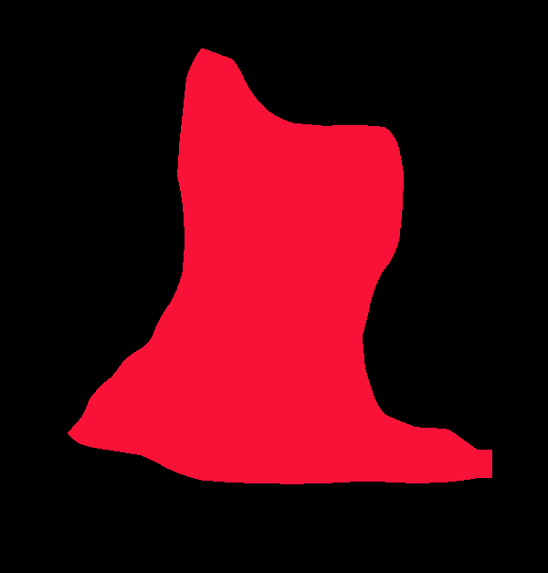

# Semantic Segmentation with TensorFlow

## Overview
This project performs **semantic segmentation** using TensorFlow and OpenCV's deep learning module. It applies a **Mask R-CNN model** to detect objects in images and video streams, overlaying segmentation masks on the detected objects.

## Project Structure
```
semantic_segmentation/
│-- images/              # Contains test images
│-- models/              # Contains Mask R-CNN model files
│   ├── mask_rcnn_inception_v2_coco_2018_01_28.pbtxt
│   ├── frozen_inference_graph.pb
│-- advancemain.py       # Runs segmentation on a static image
│-- livecam.py           # Runs segmentation on live video feed
│-- main.py              # Runs segmentation using utility functions
│-- util.py              # Helper functions for model inference
│-- output_overlay/      # Stores output images with segmentation masks
│-- requirements.txt     # Lists required dependencies
```

## Requirements
Install the dependencies using:
```bash
pip install -r requirements.txt
```
**Dependencies:**
- `numpy`
- `opencv-python`
- `Pillow`

## How It Works
The project loads a **pre-trained Mask R-CNN model** to perform segmentation.
- **advancemain.py**: Loads an image, processes it, applies segmentation, and displays results.
- **livecam.py**: Captures video from the webcam, applies segmentation in real-time, and overlays masks.
- **main.py**: Runs segmentation using helper functions from `util.py`.
- **util.py**: Defines a function to process images and extract object masks.

## Running the Project

### 1. Run Semantic Segmentation on an Image
```bash
python advancemain.py
```
### 2. Run Real-Time Segmentation from Webcam
```bash
python livecam.py
```
### 3. Run Segmentation with Utility Functions
```bash
python main.py
```

## Output Results
Segmented images and overlay results will be saved in the `output_overlay/` directory.

## Results
<!-- original image:  -->
original image: 
segmented image: 

## Future Improvements
- Improve real-time segmentation speed.
- Add support for different deep learning models.
- Optimize memory usage and model loading time.

## License
MIT License